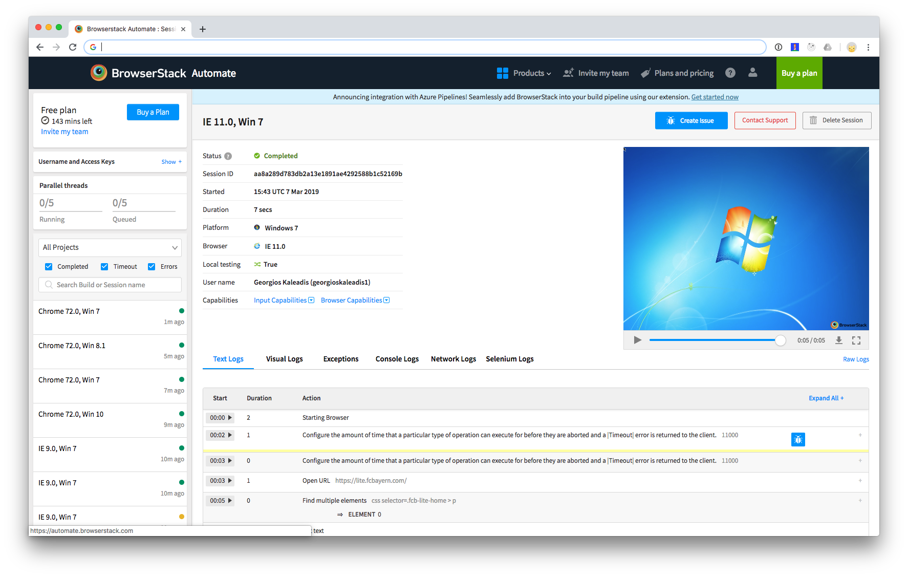

# E2E Testing
This is a demo how E2E with browserstack and protractor works.
The base for this repositoory is a default Angular application created with Angular CLI.

I removed the application part (as we are only using the protractor part)
and adjusted the angular.json file to reflect my different protractor configs.

---

There is only one test:
Visit `https://lite.fcbayern.com/en` (set via protractor config `baseUrl`)
and check if the Headline is `News`.

## Local
You can run the test locally. Configuration `e2e/local.conf.js` is used.

```
npm install
npm run e2e:local
```

This is configured to open chrome, visit the page and run the single test.


## Browserstack (Default)
For all browserstack examples make sure you provide a user and key at the given places.
Find it under `https://www.browserstack.com/accounts/settings`

```
'browserstack.user': 'user',
'browserstack.key': 'key',
```

I also provided a configuration to run it on browserstack (or virtual any other selenium grid).
The configuration can be found in `e2e/browserstack.conf.js`.

Testing is set to local. The `browserstsack-local` package installs a biinary pre-compiled for your oeprating system
(which includes your CI). That way we can easily test any infrastructure hidde behind a firewall.


## Browserstack (Multi)
Run `npm run e2e:browserstack:multi` to run the suite in multiple browsers — still using the tunnel
Here Safari & Chrome. Firefox faile randomly so I spare that for this examples.

You should see the test happening two times.

## Browserstack (Remote)

Run `npm run e2e:browserstack:remote`

That's the single capability version without a local tunnel.
We only remote control the selenium grid which is directly accessing the given base url.

## Results
Browserstack records everything
and you can find the results in the [automate dashboard](https://automate.browserstack.com)

[Video Chrome](results/chrome.mp4)<br>
[Video IE11](results/ie.mp4)




## Troubleshooting
I expose the `webdriver-update` as a npm task so you can run
it manually and pass custom properties you might need.

For example passing a proxy in your CI

```
npm run webdriver-update -- --ignore_ssl --proxy http://your-proxy-address:8080
```

or maybe you just want to run `npm run webdriver-update` in your CI step
as this prevents some errors with some webdrivers not found (like `update-config.json not found` etc).
